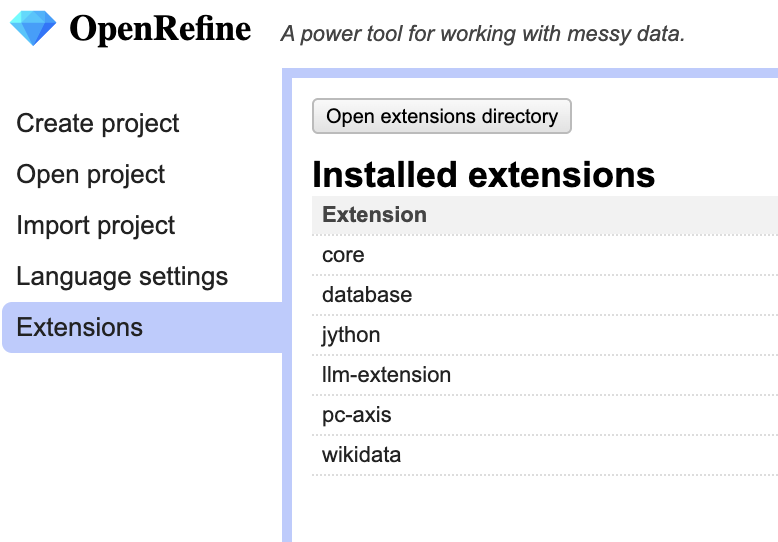
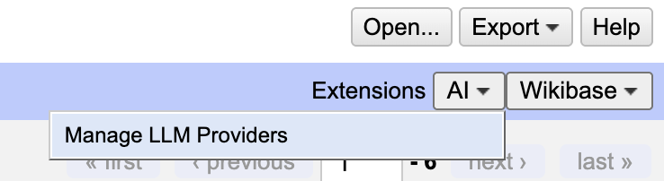
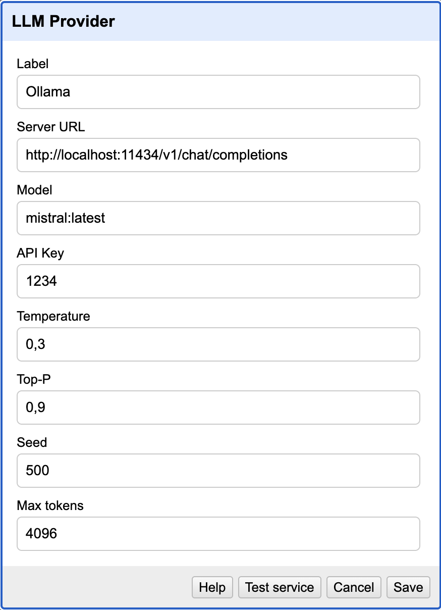

# 2. Kapitel - Ollama durch API betätigen

Wenn Ollama installiert ist, läuft die Software normalerweise immer im Hintergrund.
In diesem Zustand lässt die Software den Zugriff durch API zu.

Eine API (Application Programming Interface), auf Deutsch Programmierschnittstelle, ist eine Schnittstelle in Form von Regeln und Protokollen, die es verschiedenen Softwareanwendungen ermöglicht, miteinander zu kommunizieren, Daten auszutauschen und Funktionalitäten zu nutzen.

## Testen Eins

Gibt Ollama wirklich den API-Zugriff? Lass uns überprüfen!
1. Öffne einen beliebigen Webbrowser
1. Öffne ein neues Tab
1. Gib `localhost:11434` in die URL-Schlitz ein

... Läuft Ollama dort?

## Testen Zwei - Test mit CURL

CURL-Befehl sollte sowohl in MacOS als auch in Windows schon installiert sein.
Wir können mit CURL-Kommand den API-Zugriff weiter testen:

**Windows**
```powershell
curl -X POST http://localhost:11434/api/generate -d "{\"model\": \"[Name des Modells]\", \"prompt\": \"Ollamaとは何ですか？\", \"temperature\": 0.8, \"max_tokens\": 200 }"
```


**MacOS**
```bash
curl -X POST http://localhost:11434/api/generate -d '{
  "model": "[Name des Modells]",
  "prompt": "Ollamaとは何ですか？",
  "temperature": 0.8,
  "max_tokens": 200
}'
```

Hier haben wir in der API-Query die Parameters wie "temperature" oder "max_tokens" mitgegeben. So kann man die Reaktion eines Modells durch API kontrollieren.

## Übersicht der Parameters

- Für Kompletion: https://docs.ollama.com/api#generate-a-completion
- Für Chat-Kompletion: https://docs.ollama.com/api#generate-a-chat-completion

## Warum ist der API-Zugriff interessant?

Weil man damit eine neue Applikation erstellen kann und dadurch viel flexibler die Modelle einsetzen!

Beispiel: 
- Eine App ausprobieren: https://github.com/NbtKmy/ollama-spielwiese
- LLM in OpenRefine verwenden
- Local Deep Researcher: https://github.com/langchain-ai/local-deep-researcher

### Die App ausprobieren

1. In Ollama ein LLM und ein Embedding-Modell installieren
2. Die App installieren
3. Alles weitere zeigt der Dozent

### LLM in OpenRefine

Es gibt 2 Möglichkeiten:
1. LLM-Extension verwenden
2. Python-Code schreiben

Wir sehen beide Methode an.

#### LLM-Extension verwenden

Hier verwenden wir [LLM-Extention](https://github.com/sunilnatraj/llm-extension).

1. ZIP-file von latest release herunterladen und unzippen
2. Die ungezippte Datei in den Extention-Ordner speichern



3. LLM konfigurieren




4. Von einer Spalte her "Extract using AI" anwählen und durch das Prompt (wie unten) die Daten extrahieren


```text
Create JSON object from the description. Properties should include "name", "birth_date (YYYY-MM-DD)", "death_date (YYYY-MM-DD)", "themes_and_motifs".
```

### Python-Code schreiben

1. Schreib einen Python-Code, durch den Ollama-API abgefragt wird.

```python
#  This code is originally created by MichaelMarkert
# https://github.com/MichaelMarkert/SODa/blob/main/OR-LLM-Script.py


import json
import urllib2


Basisprompt = u"Generate a basic JSON containing only the following information on the person mentioned: dateofbirth, placeofbirth, dateofdeath, placeofdeath. Do not provide further information."

url = "http://localhost:11434/api/chat"

headers = {
    'accept': 'application/json',
    'Content-Type': 'application/json'
}

data = {
    "messages": [
        {
            "content": Basisprompt,
            "role": "system"
        },
        {
            "content": value,
            "role": "user"
        }
    ],
    "model": "mistral:latest",
    "stream": False,
    "max_tokens": 2048,
    "temperature": 0.3,
    "top_p": 0.95
}

data_string = json.dumps(data, ensure_ascii=False)
data_bytes = data_string.encode('utf-8')

req = urllib2.Request(url, data=data_bytes, headers=headers)

response = urllib2.urlopen(req)
response_bytes = response.read()
response_json = json.loads(response_bytes.decode('utf-8'))
content = response_json["message"]["content"]

return content
```

2. Öffne die Datei in OpenRefine und erstelle das Projekt
3. Klicke ein Menü-Pfile von einer Spalte, die du durch LLM analysieren lassen willst
4. Wähle `edit column > add column based this column` => Ein Popup-Fenster taucht auf
5. In dem Popup-Fenster entsprechende Information ausfüllen und los!


### Local Deep Researcher 

Demo 

```bash
cd ollama-deep-researcher
source .venv/bin/activate
uvx --refresh --from "langgraph-cli[inmem]" --with-editable . --python 3.11 langgraph dev
```

### Ollama Search (selbst erstelle App)

https://github.com/NbtKmy/ollama_search

